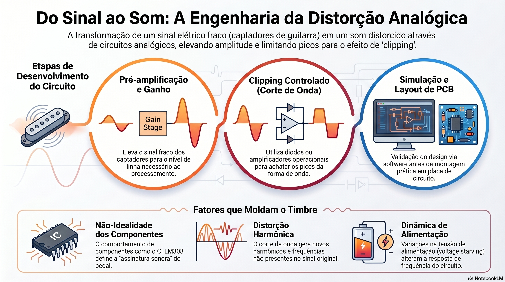

# Engenharia da Distorção Analógica: Desenvolvimento de um Pedal de Efeito para Guitarra

A Figura apresenta uma visão geral do projeto de desenvolvimento de um pedal de distorção analógico para guitarra elétrica, ilustrando as principais etapas do processamento do sinal e os fatores que influenciam a geração do timbre final.

O processo inicia-se com a captação do sinal elétrico proveniente dos captadores da guitarra. Esse sinal possui baixa amplitude e necessita ser condicionado antes de ser processado. Para isso, a primeira etapa do circuito consiste em um estágio de **pré-amplificação e ganho**, responsável por elevar o nível do sinal para uma faixa adequada de processamento. Nessa fase, o circuito amplifica as pequenas variações elétricas geradas pelas cordas, preservando as características dinâmicas da execução do músico.

Após a amplificação, o sinal é direcionado para o estágio de **clipping controlado**, considerado o núcleo do efeito de distorção. Nesse estágio, dispositivos como diodos ou amplificadores operacionais limitam a amplitude do sinal, promovendo o corte dos picos da forma de onda. Esse fenômeno altera a estrutura original do sinal e introduz componentes harmônicas adicionais, responsáveis pela característica sonora associada aos pedais de overdrive, distortion e fuzz.

Antes da implementação física, o circuito passa por uma etapa de **simulação e desenvolvimento da placa de circuito impresso (PCB)**. A utilização de ferramentas computacionais permite validar o comportamento elétrico do projeto, analisar formas de onda, verificar respostas em frequência e otimizar o layout da placa, reduzindo problemas relacionados a ruído, interferência eletromagnética e estabilidade do circuito.

Além das etapas de processamento do sinal, o projeto considera fatores fundamentais que moldam o timbre obtido. Um desses fatores é a **não-idealidade dos componentes eletrônicos**, especialmente dos amplificadores operacionais. Características como slew-rate, ganho em malha aberta, largura de banda e tensão de alimentação influenciam diretamente a resposta dinâmica do circuito. Componentes clássicos, como o amplificador operacional LM308 utilizado no pedal Pro Co RAT, demonstram que limitações físicas podem contribuir significativamente para a identidade sonora de um equipamento.

Outro aspecto relevante é a **geração de distorção harmônica**, consequência direta do processo de clipping. O achatamento da forma de onda produz novas frequências harmônicas que não estavam presentes no sinal original, enriquecendo o espectro sonoro e proporcionando maior sensação de sustain, corpo e agressividade ao timbre.

Por fim, o projeto explora a influência da **dinâmica da alimentação elétrica**, incluindo técnicas de *voltage starving*. A variação controlada da tensão de alimentação modifica o comportamento dos componentes ativos, alterando a função de transferência do circuito e produzindo diferentes níveis de saturação, compressão e intermodulação. Esse recurso amplia a versatilidade do pedal e permite a obtenção de características sonoras únicas.

Dessa forma, a figura sintetiza o fluxo completo do desenvolvimento do pedal de distorção analógico, desde a entrada do sinal da guitarra até a obtenção do timbre final, destacando os principais conceitos de eletrônica analógica, processamento de sinais e engenharia de áudio empregados no projeto.

